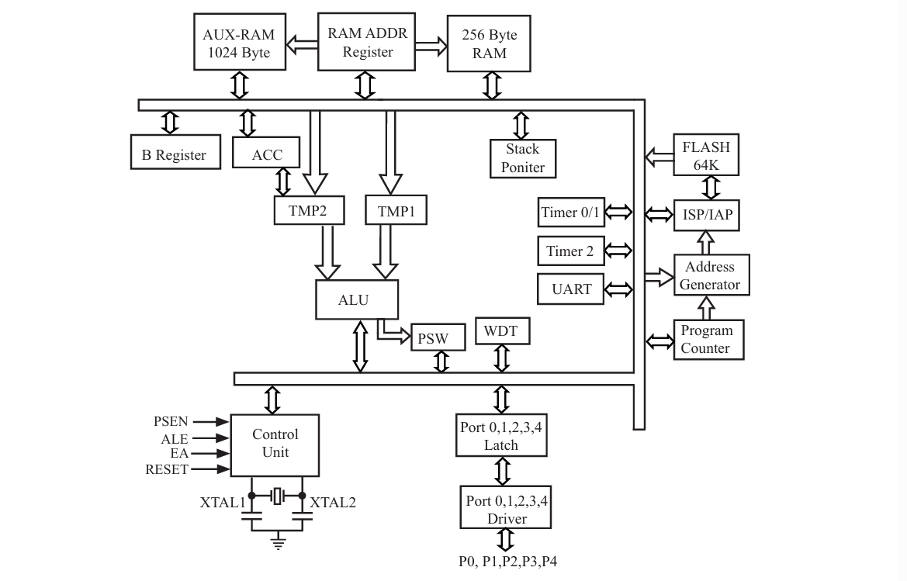
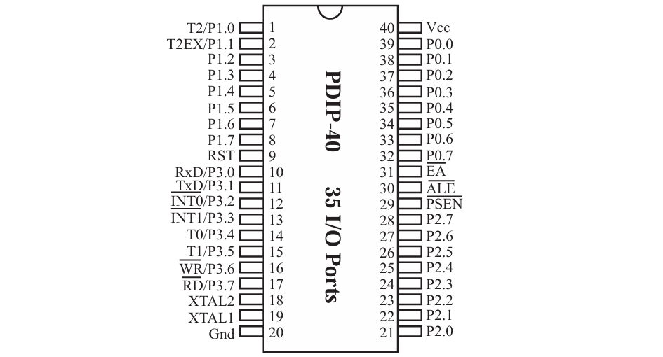
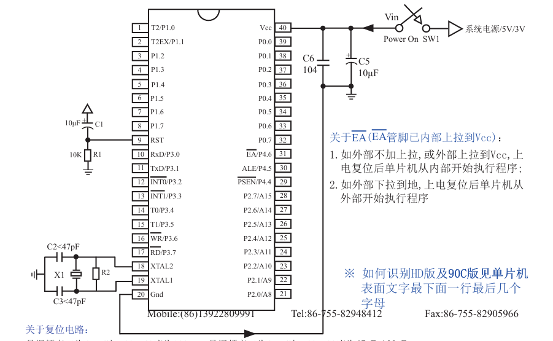

# 单片机及开发板介绍

> 总入口：

单片机（Micro Controller Unit），简称MCU。内部集成了CPU、RAM、ROM、定时器、中断系统、通讯接口等一系列电脑的常用硬件功能。

单片机的任务是信息采集（依靠传感器）、处理（依靠CPU）和硬件设备（例如电机、LED等）的控制

### 为什么叫“51”？

51系列单片机的命名由来与它的设计和开发历史相关。这个系列的单片机主要由Intel的8051微控制器发展而来，后来被多个公司采用和改进，形成了一个广泛使用的微控制器平台。Intel在1980年代初推出了8051，它是一个基于MCS-51架构的8位微控制器，具有丰富的内部资源，如8位CPU、4KB的ROM、128字节的RAM、定时器/计数器、并行和串行接口等。51系列单片机继承了8051的架构，包括指令集、寄存器配置、内部结构等，但同时进行了改进和扩展。例如，部分51系列单片机增加了外部RAM的寻址能力、增加了中断源、提供了更多的I/O引脚等。

## STC89C52单片机

所属系列：51单片机系列

公司：STC公司

位数：8位

RAM：512字节

ROM：8K（Flash）

工作频率：12Mhz

### STC89C52系列单片机命名规则

> STC89C52
>
> 35I-PDIP40

- STC：代表公司
- 89：代表系列，此处是STC 12T/6T 8051
- X：代表工作电压
  - C：5.5-3.8V
  - LE：3.5-2.4V/3.4V=2.4V
- XX：程序空间及RAM空间大小，如52是8K字节程序空间及512字节RAM空间
- 35：代表工作频率，工作频率可到35MHz
- X：代表工作温度范围
  - I：工业级，-40~-85°C
  - C：商业级，0~70°C
- XXXX：代表封装类型
  - **PDIP（Plastic Dual In-line Package）塑料双列直插式封装**
    - 这是一种传统的封装方式，具有两个平行的引脚排列在器件的两侧。
    - 引脚从封装体两侧伸出，可以直接插入印刷电路板（PCB）上的孔中。
    - PDIP封装通常用于较慢的信号处理和较低的引脚数量。
  - **LQFP（Low-profile Quad Flat Package）低轮廓四边扁平封装**
    - 这种封装比传统的QFP（Quad Flat Package）更薄，适合表面贴装技术（SMT）。
    - 引脚位于封装的四边，呈扁平状，有助于提高封装密度。
    - LQFP封装适用于需要较高引脚数量和较薄封装的应用。
  - **PLCC（Plastic Leaded Chip Carrier）塑料有引线芯片载体**
    - PLCC封装是一种四边形的封装，具有J形引脚，这些引脚从封装体的四个侧面引出。
    - 这种封装提供了比DIP更好的热性能和电气性能，同时保持了较低的成本。
    - PLCC封装适用于需要较高性能和引脚数量的器件。
  - **PQFP（Plastic Quad Flat Package）塑料四边扁平封装**
    - PQFP是一种表面贴装封装，引脚位于封装的四边，呈扁平状。
    - 与LQFP相比，PQFP通常具有更高的引脚数量，但引脚间距较大，因此占用的空间也更大。
    - PQFP封装适用于需要大量引脚和较高性能的应用。
- XX：代表管脚数

> 1. **PDIP (Plastic Dual In-line Package)**:
>    - **Plastic**: 塑料，指的是封装材料，通常用于低成本和易于制造的封装。
>    - **Dual**: 双，表示引脚排列在器件的两侧。
>    - ​          **In-line**: 直线排列，指的是引脚沿着器件的两侧直线排列。
>    - **Package**: 封装，指用于保护半导体芯片并提供电气连接的外壳。
>
> 2. **LQFP (Low-profile Quad Flat Package)**:
>    - **Low-profile**: 低轮廓，意味着封装的高度较低，适合空间受限的应用。
>    - **Quad**: 四边，表示引脚分布在四个侧面。
>    - **Flat**: 平坦，指的是引脚是扁平的，适合表面贴装。
>    - **Package**: 封装，同上。
>
> 3. **PLCC (Plastic Leaded Chip Carrier)**:
>    - **Plastic**: 塑料，封装材料。
>    - **Leaded**: 有引线的，指的是封装体上有引线。
>    - **Chip**: 芯片，指这种封装用于封装小型的半导体芯片。
>    - **Carrier**: 载体，指这种封装作为芯片的载体，提供物理支撑和电气连接。
>
> 4. **PQFP (Plastic Quad Flat Package)**:
>    - **Plastic**: 塑料，封装材料。
>    - **Quad**: 四边，引脚分布在四个侧面。
>    - **Flat**: 平坦，引脚是扁平的。
>    - **Package**: 封装，同上。
>

### 单片机内部结构图

1. 贯穿始终的**总线（BUS）**

2. **程序存储器(Flash)**：这是存储微控制器程序的地方，就像电脑的硬盘，用来存放软件。

3. **RAM**：随机存取存储器，用来临时存储数据和程序运行时的变量。

4. **AUX-RAM**：辅助RAM，提供额外的存储空间，可以用于存储更多的临时数据。

5. **寄存器**：这些是微控制器内部的小型存储单元，用于存储指令和数据，以及控制微控制器的操作。

6. **B寄存器和ACC（累加器）**：这些是特殊的寄存器，用于数学运算，比如加法和减法。

7. **双数据指针和堆栈指针**：这些指针用于指向RAM中的特定位置，帮助微控制器管理数据和程序的执行。

8. **ISP/IAP**：在系统编程/在应用编程，允许在不从电路板上移除芯片的情况下更新程序。

9. **TMP1和TMP2**：临时寄存器，用于存储中间计算结果。

10. **定时器0/1和定时器2**：这些是计时器，可以用于测量时间间隔或产生定时信号。

11. **地址生成器**：负责生成内存地址，以便微控制器可以访问存储器中的数据。

12. **串口**：用于与其他设备进行串行通信。

13. **ALU（算术逻辑单元）**：执行所有的算术和逻辑运算。

14. **程序计数器（PC）**：存储下一条要执行的指令的地址。

15. **WDT（看门狗定时器）**：一种特殊的定时器，用于防止程序运行错误或卡死。

16. **EEPROM**：一种可以电擦写的存储器，用于存储需要长期保存的数据。

17. **PSW（程序状态字寄存器）**：存储运算结果的状态，比如是否发生了溢出。

18. **Control Unit（控制单元）**：微控制器的大脑，负责控制指令的执行流程。

19. **Port 0,1,2,3,4**：这些是输入输出端口，用于连接外部设备。

20. **RESET**：复位引脚，用于重启微控制器。

21. **XTAL1和XTAL2**：连接外部晶振的引脚，用于提供时钟信号。

22. **P0, P1, P2, P3, P4**：这些是微控制器的引脚，可以配置为输入或输出，用于与外部世界交互。

### 单片机管脚图

引脚8位一组，与工作位数相匹。

### 单片机最小应用系统

#### 1.电容滤波

电源可能有干扰，不稳定

#### 2.晶振电路

#### 3.复位电路
