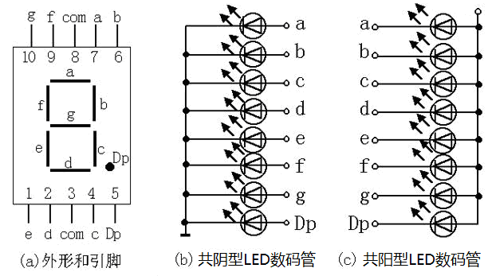
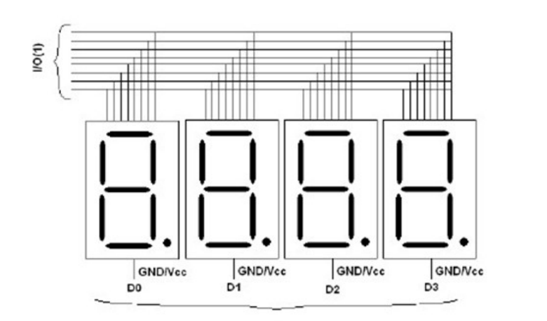
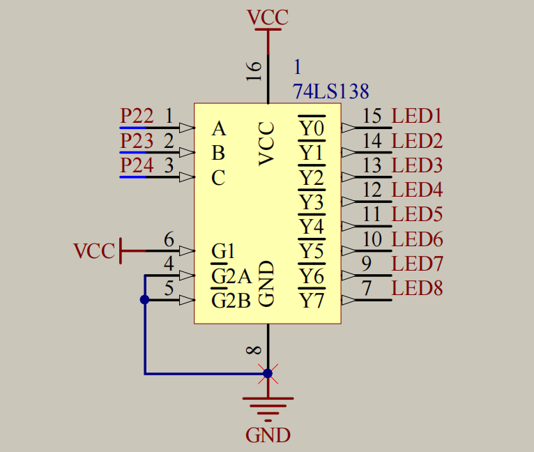
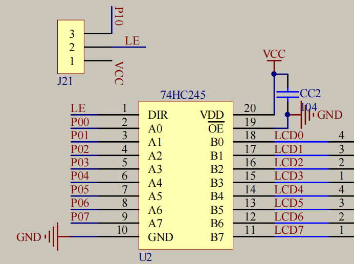

# 数码管

## 数码管介绍

LED数码管：数码管是一种简单、廉价的显示器，是由多个发光二极管封装在一起组成的“8”字型的器件。

## 数码管引脚定义

- 一位数码管



不同开发板，也都有对应的IO口。

- 多位一体数码管

同样分为共阳极与共阴极。共8+4=12个引脚，其中4个为单独的公共端。



如果只想亮一个数字，对于共阴极而言，选择一个接地，剩下的接高电平即可；再给8个引脚指定的电平。因此，此类数码管无法在同一时刻显示多个不同的数字。

如何同时显示不同数字？——动态数码管显示。

利用人眼的视觉暂留和数码管的显示余晖，不断进行扫描。

## 位选与段选

位选和段选是数码管显示控制中的两个重要概念，通常用于动态数码管显示系统中。它们分别控制数码管的显示位置和显示内容。

### 位选（Digit Select）
- **定义**：位选信号用于选择数码管的显示位置，即决定哪个数码管被激活并显示数字。
- **工作原理**：在一个多位数码管系统中，每个数码管都需要一个位选信号来控制其是否被激活。例如，在一个四位数码管中，需要四个位选信号，分别对应四个数码管。通过控制这些位选信号，可以依次激活每个数码管进行显示。
- **应用**：在动态显示中，位选信号通常以一定的频率轮流激活每个数码管，以便在视觉上形成连续的显示效果.

### 段选（Segment Select）
- **定义**：段选信号用于选择数码管的显示内容，即决定数码管显示哪个数字或字符。
- **工作原理**：数码管由多个段（segment）组成，每个段对应一个特定的形状。通过控制这些段的亮/灭状态，可以组合成不同的数字或字符。例如，七段数码管有七个段，分别标记为a、b、c、d、e、f、g，通过控制这些段的亮/灭状态，可以显示0到9的数字。
- **应用**：在显示数字时，根据需要显示的数字，控制相应的段选信号，使对应的段亮起，从而显示正确的数字。例如，要显示数字“5”，则需要使段a、c、d、f、g亮起，而段b、e保持熄灭状态.

### 协同工作
- **动态显示**：在动态数码管显示系统中，位选和段选信号需要协同工作。首先，通过位选信号激活一个数码管，然后通过段选信号控制该数码管显示相应的数字或字符。接着，切换到下一个数码管，重复上述过程。由于刷新频率足够高，人眼无法察觉到数码管的切换，从而形成连续的显示效果.
- **消影**：在切换位选信号时，通常需要先将段选信号清零，以消除前一个数码管的显示内容，防止残影现象的发生.

## 138译码器



### 功能

把**8**个公共端由**3**个PIO口控制。

###  结构

- A-B-C：3个输入端

- Y0~Y7：8个输出端

- 上下两端接电源

- G1、G2A、G2B：使能端

  一种电源开关。

  G1需要接上高电平，G2A/B需要接上低电平

> 在数字电路中，使能端（Enable Pin）是一个控制信号输入端，用于控制芯片或电路是否处于工作状态。对于译码器来说，使能端的作用是决定译码器是否进行译码操作。
>
> 具体来说，译码器的使能端通常有以下功能：
> 1. **控制译码器的启用与禁用**：当使能端为有效电平时（可能是高电平或低电平，具体取决于设计），译码器开始工作，对输入信号进行译码。如果使能端为无效电平，则译码器停止工作，输出保持在某个固定状态。
> 2. **选择工作模式**：在一些复杂的译码器中，使能端可以用来选择不同的工作模式或功能。
>
> 例如，在74LS138译码器中，有三个使能端（G1、G2A、G2B），只有当这些使能端的电平组合满足特定条件时，译码器才会正常工作。这种设计使得译码器可以在同一块芯片上实现多个功能，提高了电路设计的灵活性。

### 实现方式

输入端有3个接口，每个接口可以输入高电平和低电平**2**种方式，因此一共可以产生 $2^3=8$ 种组合方式。

因C口处在高位且A处在低位，故将CBA表示的二进制数（高电平为1，低电平为0）转化为十进制数**n**，代表**Y(n-1)**口提供低电平，其它提供高电平。

从而，激活第n个数码管。

PS：此开发板是共阴极数码管

## 74HC245



74HC245是一款高速CMOS双向总线收发器，常用于数字电路中以增强信号的驱动能力和实现**双向数据传输**。

### 功能
- **双向数据传输**：74HC245具有八路双向数据传输功能，可以通过方向控制引脚（DIR）来决定数据的传输方向。当DIR为高电平时，数据从A端传输到B端；当DIR为低电平时，数据从B端传输到A端。
- **三态输出**：具有三态输出功能，可以通过输出使能引脚（OE）来控制输出端的状态。当OE为低电平时，输出端处于使能状态；当OE为高电平时，输出端处于高阻态。
- **电平转换**：可以用于不同逻辑电平之间的转换，例如将3.3V逻辑电平转换为5V。

### 应用
- **驱动增强**：由于单片机等微控制器的引脚驱动能力有限，74HC245可以用来增强这些引脚的驱动能力，从而驱动较大的负载，如数码管或显示屏。
- **总线扩展**：在微处理器和微控制器系统中，用于扩展数据总线，增强系统的处理能力和灵活性。
- **信号隔离**：在需要电气隔离的应用中，可以防止高电压干扰低电压部件，确保系统的安全稳定运行。

### 引脚功能
- **DIR（方向控制引脚）**：用于控制数据传输的方向。
- **OE（输出使能引脚）**：用于控制输出端口是否有效。
- **A1-A8、B1-B8（数据传输引脚）**：用于连接不同总线之间进行数据传输。

## 单管显示

- 显示“6”

6对应"b"和"dp"不亮，根据开发板原理图可知，B0~B1 / P00~P07对应的是 1011 1110.

高位对高位，此处P0口赋值应是：$(0111 \ 1101)_2=(7D)_{16}$

```c
#include <REGX52.H>

void main(){
	// 先选择
	P2_4 = 1;
	P2_3 = 0;
	P2_2 = 1;
	P0 = 0x7D;
	while(1){
    }
}
```

- 通用显示

```c
#include <REGX52.H>

unsigned char NixieTable[]={0x3F,0x06,0x5B,0x4F,0x66,0x6D,0x7D,0x07,0x7F,0x6F,0x77,0x7C,0x39,0x5E,0x79,0x71,0x00};

void NixieTube(unsigned char Location, Number){
	switch(Location){
		case 1:	P2_4=1, P2_3=1, P2_2=1;break;
		case 2:	P2_4=1, P2_3=1, P2_2=0;break;
		case 3:	P2_4=1, P2_3=0, P2_2=1;break;
		case 4:	P2_4=1, P2_3=0, P2_2=0;break;
		case 5:	P2_4=0, P2_3=1, P2_2=1;break;
		case 6:	P2_4=0, P2_3=1, P2_2=0;break;
		case 7:	P2_4=0, P2_3=0, P2_2=1;break;
		case 8:	P2_4=0, P2_3=0, P2_2=0;break;
		default: break;
	}
	P0 = NixieTable[Number];
}

void main(){
	NixieTube(1,3);
	while(1){
    }
}
```

## 数码管的消影

在反复的“位选-段选-位选-段选……”中，上一个的“段选”会传位到当前的“位选中。

以下是几种常见的消影方法：

1. 清零段选线

在切换到下一个数码管显示之前，先将当前数码管的所有段选线清零（即设置为不亮的状态）。这样可以确保在切换到下一个数码管时，前一个数码管的显示内容不会残留。

2. 同步控制

确保位选和段选信号的同步切换。如果位选和段选信号不同步，可能会导致前一个数码管的显示内容在切换到下一个数码管时仍然显示出来，从而产生残影。

3. 使用消影电路

在数码管的驱动电路中加入消影电路，通过硬件方式来快速清除前一个数码管的显示内容。

4. 提高刷新频率

增加数码管的刷新频率，使得每个数码管的显示时间更短，从而减少人眼对残影的感知。

## 动态显示（清零段选线）

```c
#include <REGX52.H>

unsigned char NixieTable[]={0x3F,0x06,0x5B,0x4F,0x66,0x6D,0x7D,0x07,0x7F,0x6F,0x77,0x7C,0x39,0x5E,0x79,0x71,0x00};

void Delayms(unsigned int xms)	//@12.000MHz
{
	unsigned char data i, j;
	while(xms--){
		i = 2;
		j = 239;
		do
		{
			while (--j);
		} while (--i);
	}
}

void NixieTube(unsigned char Location, Number){
	switch(Location){
		case 1:	P2_4=1, P2_3=1, P2_2=1;break;
		case 2:	P2_4=1, P2_3=1, P2_2=0;break;
		case 3:	P2_4=1, P2_3=0, P2_2=1;break;
		case 4:	P2_4=1, P2_3=0, P2_2=0;break;
		case 5:	P2_4=0, P2_3=1, P2_2=1;break;
		case 6:	P2_4=0, P2_3=1, P2_2=0;break;
		case 7:	P2_4=0, P2_3=0, P2_2=1;break;
		case 8:	P2_4=0, P2_3=0, P2_2=0;break;
		default: break;
	}
	P0 = NixieTable[Number];
	Delayms(1); //立马清零的话，数码管亮度会较暗
	P0 = 0x00;
}

void main(){
	while(1){
		NixieTube(1,1);
		NixieTube(2,2);
		NixieTube(3,3);
    }
}
```

## 数码管驱动方式

- 单片机直接扫描

  硬件设备简单，因为需要不断while循环去扫描，所以会消耗大量单片机CPU时间

- 专用驱动芯片

  内部自带显存、扫描电路，单片机只需告诉它们显示什么即可

