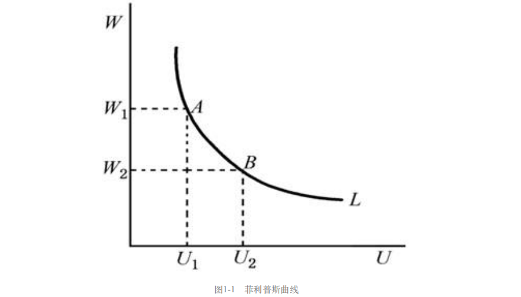

# 第1章 经济学十大原理

**经济（economy）** 来源于希腊语，意思是“管理一个家庭的人”。

同家庭一般，社会面临许多决策——要做什么工作以及谁来做这些工作。

**稀缺性（scarcity）** 是指社会拥有的资源是有限的，因此不能生产人们希望拥有的所有物品与服务。

**经济学（economics）** 研究社会如何管理自己的稀缺资源，经济学的研究是多方面的，但可以用几个核心思想把这个领域统一起来。

## 1.1 人们如何做出决策

经济只不过是生活中相互交易的人们所组成的群体而已，由于一个经济的行为反映了组成这个经济的个人的行为，所以从个人如何做出决策的四个原理开始。

### 1.1.1 原理一：人们面临权衡取舍

做出决策就是要求我们在一个目标与另一个目标之间进行权衡取舍。

社会面临的经典权衡取舍是**“大炮与黄油”**，可以理解为军事开始与民用经济之间的取舍。

社会面临的另一种取舍是**“效率与平等”**。

**效率（efficiency）**是指社会能从其稀缺资源中得到最大的利益，**平等（equality）**是指将这些利益平均地分配给社会成员。提高效率就是在做大蛋糕，发扬平等就是在切好蛋糕。

### 1.1.2 原理二：某种东西的成本是为了得到它所放弃的成本

**机会成本（opportunity cost）**是为了得到这种东西所必须放弃的东西。

### 1.1.3 原理三：理性人考虑边际量

经济学家通常假设人是理性的。当可用的机会给定时，**理性人（rational people）** 系统而有目的地尽最大努力去实现其目标。

> “其”，说明这个目标指向个人目的，这渗透着西方的价值观。而在中文语境之下，人的理性建立在基础道德之上；比如，可能因为有国才有家的文化理念，妨碍公共利益的利己行为，会被我们认知为“非理性”。

理性人知道，生活中的许多决策很少是黑与白之间的选择，而往往是介于其间的灰色地带。如吃饭时，决策往往不是“不吃，还是大吃特色”，而更可能是“是否再多吃一勺土豆泥”。经济学家用**边际效应（marginal change）** 这个术语来描述对现有行动计划的微小增量调整。

”边际“指”边缘“，因此边际变动是围绕你所做的事的边缘来进行调整。理性人通常通过比较边际收益（marginal benefit）与边际成本（marginal cost）来作决策。

#### 案例一：是否该打电话

已知：

- 给朋友打电话10分钟带来的收益为7美元左右。
- 手机的服务费为每月40美元的固定费和每分钟0.5美元的通话费用。且你通常打每月打电话100分钟，因此你每月费用为90美元。

问，这种情况下你是否应该打电话？

视角一：平均每分钟的电话费为$90/100=0.9$美元，因此10分钟的电话费为9美元，大于收益7美元，所以不打。

视角二：虽然**平均成本**是9美元，但多打10分钟电话的**边际成本**是5美元，小于**边际收益**7美元，所以打。

#### 案例二：如何决定对等退票的乘客收取多高的价格

已知：

- 一架有200个座位的飞机横越美国飞行一次的成本是10万美元——>每个座位的平均成本是 500 美元。
- 设想起飞时仍有10个空位，而在登机口等退票的乘客愿意支付300美元买一张机票。

问，航空公司是否应该把票卖给他？

视角一：人们很容易得出结论：票价绝不应该低于500美元，所以不卖。

视角二：虽然每位乘客飞行的**平均成本**是500美元，但**边际成本**仅仅是这位额外的乘客将消费的一罐软饮料的成本而已。只要等退票的乘客所支付的价格高于边际成本，那么卖给他机票就是有利可图的。

而事实上，一个理性的航空公司往往会通过考虑**边际量**而设法增加利润。

#### 案例三：为什么水便宜，而钻石如此昂贵？

已知：

- 人们需要水来维持生存，而钻石不是必需的。
- 人们愿意为钻石支付的钱要远远多于水。

原因：

人们对物品的支付意愿基于增加一单位该物品所获得的边际效益，边际收益又取决于一个人已经拥有多少种物品。

水的确是必不可少的，但增加一杯水的边际收益微不足道，因为水太多了。钻石呢，反之。

###  1.1.4 原理四：人们会对激励做出反应

**激励（incentive）**是引起一个人做出行动的某种东西。在经济学研究中，激励起着中心作用。一位经济学家甚至提出，整个经济学的内容可以简单概括为：“人们对激励做出反应。其余内容都是对此的解释”。

在分析市场如何运行时，激励起到关键作用：当苹果价格上调，人们决定少吃苹果；同时，苹果园主决定雇用更多工人并多摘苹果。

政府决策也和激励有关，许多政策改变了人们面临的成本或收益，从而改变了人们的行为。

安全带法律的通过，直接影响是发生车祸的存活率的提高。同时，它也通过改变激励而影响了人们的行为，在这里，相关行为是司机开车的的速度和谨慎程度。这里，**边际成本**是时间和精力，从而实现缓慢而谨慎地开车；而**边际收益**则是驾车的安全性提高。

可安全带减少了缓慢而谨慎地开车的收益（因为安全性的增量变少了），所以人们选择更快速、更不谨慎地开车。这样，这些法律减少了每次车祸的死亡人数，但是增加了车祸的次数——萨姆·佩兹曼的净结论是，司机死亡人数变动很小，行人死亡人数有所增加。

## 1.2 人们如何相互影响

### 1.2.1 原理五：贸易可以使每个人的状况都变得更好

经济中，虽然每个家庭都会与所有其他家庭相竞争，但正是在贸易中，每个人专门从事自己最擅长的活动，用较低的成本获得各种各样的物品与服务。

国家与家庭一样，也能从相互贸易中获益。

### 1.2.2 原理六：市场通常是组织经济活动的一种好方法

支撑中央计划的理论是，只有政府才能以促进整个社会经济福利的方式组织经济活动。

**市场经济（market economy）**是当许多企业和家庭在物品与服务市场上相互交易时，通过他们的分散决策配置资源的经济。

《国富论》提出了经济学中最著名的观察结果：家庭和企业在市场上相互交易，他们仿佛被一只“看不见的手”所指引，并带来了合意的市场结果。

> ## 亚当·斯密与看不见的手
>
> 人类几乎随时随地都需要同胞的协助，因此要想仅仅依赖他人的恩惠，那是绝对不行的。一个人如果能够刺激他人的利己心，使其有利于他，并告诉其他人，给他做事是对他们自己有利的，那么他要达到目的就容易得多了。……请把我所要的东西给我吧，同时，你也可以获得你所要的东西：这句话正是交易的通义。我们所需要的相互帮忙，大部分是依照这个方法取得的。
>
> 我们每天所需的食物和饮料，不是出自屠户、酿酒师或面包师的恩惠，而是出自他们利己的打算。我们不说唤起他们利他心的话，而说唤起他们利己心的话。我们从来不说自己有需要，而只说对他们有利。社会上，除了乞丐，没有一个人愿意全然依靠别人的恩惠过活。……
>
> 每一个人……既不打算促进公共的利益，也不知道自己是在何种程度上促进那种利益……他所盘算的只是他自己的利益。在这种场合下，像在其他许多场合一样，他受着一只看不见的手的引导，去尽力达到一个并非他本意想要达到的目的。但也并不会因为不是出于本意，就对社会有害。他追求自己的利益，往往能使他比在真正出于本意的情形下更有效地促进社会的利益。
>
> **斯密是说，经济参与者受利已⼼所驱动，⽽市场上这只看不见的⼿指引这种利⼰⼼去促进总体的经济福利。**

### 1.2.3 原理七：政府有时可以改善市场结果

我们需要政府的原因之一是：只有当政府落实规则并维护对市场经济至关重要的制服时，看不见的手才能施展其魔力。

更重要的是，市场经济需要实施**产权（property rights）**制度，以便个人拥有和控制稀缺资源的能力。

我们需要政府的另一个原因是：尽管看不见的手是强有力的，但并不是无所不能的。政府干预经济并改变人们自己选择的资源配置的原因大体有两类：促进效率或促进平等。

- 效率目标

**市场失灵（market failure）**：市场本身不能有效配置资源的情况。

原因之一是**外部性（externality）**，即一个人的行为对旁观者的福利产生了影响，例如一种产品的生产污染了空气并引起附近的人们的健康问题，而市场本身不能将这种成本考虑在内。

原因之二是**市场权力（market power）**，即单个经济活动者（或某个经济活动小群体）对市场价格有显著影响的能力，这不利于看不见的手以竞争来约束个人的利己行为。

- 平等目标

市场根据人们生产其他人愿意购买的东西的能力来给予其报酬。但是其不能保证每个人都有充足的食物、体面的衣服和完善的医疗保健。

 当然了，政府可以完善市场结果，但并总能发挥积极作用。

## 1.3 整体经济如何允许

### 1.3.1 原理八：一国的生活水平取决于它生产物品与服务的能力

世界各国生活水平的差别是惊人的。

几乎所有生活水平的差别都可以归因于各国**生产率（productivity）**的差别，即每一单位劳动投入所生产的物品与服务数量的差别。在那些每单位时间工人能产生大量物品与服务的国家，大多数人享有高生活水平，反之。同样，一国生产率的增长率决定了它的平均收入的增长率。

生产率和生活水平之间的基本关系是简单的，但它的意义却是深远的。如果生产率是生活水平的首要决定因素，那么其他因素就应该是次要的。

生产率与生活水平之间的关系对于公共政策也有深远意义。在考虑一项任何一项政策如何影响生活水平时，关键问题是要分析这项政策如何影响我们生产物品与服务的能力。这就意味着，决策者需要帮助工人受到良好的教育、拥有生产物品与服务需要的工具以及获得最好的技术来提高生产率。

我们的政策归根到底是要为人民服务的，但这并不意味着直接使人民享福，授之以鱼不如授之以渔，帮助人们提高生产率才是实现人民幸福的更底层渠道。

### 1.3.2 原理九：当政府发行了过多货币时，物价上升

**通货膨胀（inflation）**：经济中物价总水平的上升

### 1.3.3 原理十：社会面临通货膨胀与失业之间的短期权衡取舍

虽然在长期中物价水平上升主要是货币量增加的结果，但短期中，问题就变得更为复杂且更具争议性。

大多数经济学家是这样描述货币注入的短期效应的：

- 经济中货币量增加刺激了社会的整体支出水平，从而增加了对物品与服务的需求。
- 随着时间推移，需求的增加会引起企业提高物价，但同时，它也鼓励企业雇佣更多工人，并生产更多的物品与服务。
- 雇佣更多的工人意味着更少的失业。

上述推理过程的除了一种在整个经济范围内的最终的权衡取舍：通货膨胀与失业之间的短期权衡取舍。

**经济周期（business cycle）**是用生产的物品与服务量或雇佣的人数来衡量的经济活动的无规律的、很大程度上无法预测的**波动**。

## 课后

> 部分内容涉及”宏观经济学“知识，日后再进行更为细致的补充和梳理。

### 快速单选

1. 经济学最好的定义是对 **社会如何管理其稀缺资源** 的研究
2. 你去看一场电影的机会成本是 **去看电影所需要的所有现金支出加上你的时间的价值**
3. 边际变动 **是逐步地改变现有计划**
4. 亚当·斯密地看不见的手是指 **自由市场达到合意结果的能力（尽管市场参与者是利己的）**
5. 政府干预市场经济是为了 **保护产权、纠正由于外部性引起的市场失灵、达到更为平等的收入分配**
6. 如果一个国家有高而持续的通货膨胀，最有可能的解释是：**中央银行发行了过量货币**

### 内容提要

关于个人做出决策的基本结论是：人们面临不同目标之间的权衡取舍；任何一种行为的成本可以用其所放弃的机会来衡量；理性人通过比较边际成本与边际收益做出决策；人们根据他们所面临的激励改变自己的行为。

关于人们之间相互影响的基本结论是：贸易和相互依赖性可以是互利的；市场通常是协调人们之间经济活动的一种好方法；通过纠正市场失灵或者提高经济中的平等程度，政府可能改善市场结果。

关于整体经济的基本结论是：生产率是生活水平的最终根源；货币量的增长是通货膨胀的最终根源；社会面临通货膨胀与失业之间的短期权衡取舍。

### 关键概念

稀缺性
经济学
效率
平等
机会成本
理性人
边际变动
激励
市场经济
产权
市场失灵
外部性
市场势力生产率通货膨胀经济周期

### 复习题（部分）

4. 为什么决策者应该考虑激励？

   激励从其词意上看，就是指激发⿎励的意思。具体来说，激励是指激发⼈的⾏为动机，使⼈有⼀股内在动⼒，以促使个体更好地实现⾏为⽬标。激励也可以说是调动积极性的过程。从⼈的⾏为规律来看，⾏为的每⼀个阶段，每⼀个过程都存在着如何激励的问题。激励有利于调动⼈们潜在的⼯作积极性和主动性，创造性地进⾏劳动，出⾊地去实现既定的⽬标，不断提⾼⼯作效率，创造更多的物质财富。

   政策制定者应该考虑激励的原因有：

   （1）⼈们会对激励做出反应，⽽政策会影响激励。例如，对汽油征税，⼈们就会考虑开⼩型、节油型汽车。

   （2）政策有时也会产⽣事先并不明显的影响。例如，美国国会通过⽴法要求汽车公司⽣产包括安全带在内的各种安全设备，使得安全带成为汽车的标准设备。安全带降低了司机伤亡的概率，从⽽减少了司机的车祸代价；换⾔之，安全带减少了缓慢⽽谨慎地开车的利益。在这种激励下，⼈们对安全带的反应是更快地开车，结果司机死亡⼈数变少，⽽⾏⼈死亡⼈数增加了。

   因此，在分析任何⼀个政策时，政策制定者不仅应该考虑直接影响，⽽且还应该考虑因为激励⽽发⽣的间接影响，从⽽使制定的政策取得良好的效果。

5. 为什么各国之间的贸易不像⼀场⽐赛那样有赢家和输家呢？

   经济学原理表明：贸易能使每个⼈的状况都变得更好。各国之间的贸易并不像⼀场⽐赛那样有赢家和输家，具体来讲，其原因可以从以下两个⽅⾯来分析：

   （1）贸易不是零和博弈。⼀些⼈按照赢家和输家来看待交换。他们对贸易的反应是，在出售之后，如果卖者幸福，则买者⼀定倒霉，因为卖者必定从买者那⾥得到了点什么。也就是说，他们把贸易视为⼀⽅获益则另⼀⽅必定受损的零和博弈。这些⼈没有认识到，双⽅都是⾃愿交易⽽获益，因为允许各⽅从事其最有效的⽣产，然后交换另⼀⽅更有效⽣产的东西，没有⼈遭受损失，⽽且贸易是⾃愿的。

   （2）各国之间的贸易之所以不像⼀场⽐赛那样有赢家和输家，是因为贸易可以使贸易各⽅受益。通过国际分⼯可以使各国专门从事⾃⼰最擅长的活动，这种专业化⽣产可以提⾼效率，再通过贸易交换可以使贸易各⽅都能以较低的成本获得各种各样的物品与服务，从⽽使得各⽅的福利都增加。因此，在公平的贸易中可以得到“双赢”或者“多赢”的结果。

6. 市场中的看不见的⼿会做什么呢？

   （1）亚当·斯密提出了“看不见的⼿”原理。亚当·斯密在《国富论》（1776年）中写道：“每个⼈都在⼒图使⽤他的资本，来使其⽣产品能得到最⼤的价值。⼀般地说，他并不企图增进公共福利，也不知道他所增进的公共福利为多少。他所追求的仅仅是他个⼈的安乐，仅仅是他个⼈的利益。在这样做时，有⼀只看不见的⼿引导他去促进⼀种⽬标，⽽这种⽬标绝不是他所追求的东西。由于追逐他⾃⼰的利益，他经常促进了社会利益，其效果要⽐他真正想促进社会利益时所得到的效果要⼤。”

   （2）亚当·斯密“看不见的⼿”理论认为：只要每⼀个⼈都是理性的，并且都追求⾃⾝效⽤最⼤化，那么就不需要有⼈来管理，将会有⼀只“看不见的⼿”来进⾏调控，经济运⾏由此可以⾃动达到最佳状态。即“看不见的⼿”通过价格机制、供求机制、竞争机制来⾃动调节⼈们的⾏为以使社会福利最⼤化。

   （3）该思想包含着三个要点：① 追求个⼈利益是⼈类从事经济活动的主要动⼒；② 市场这只看不见的⼿⾃发地将各种个⼈利益转变为⼀种共同利益；③ 对国民财富的增长来说，政府对经济管得越少越好。福利经济学继承了亚当·斯密的思想，认为⾃由放任的市场可以⾃发地导致共同利益的增加。

9. 什么引起了通货膨胀？

   通货膨胀是流通中货币量的过度增加⽽造成的货币贬值，由此导致经济⽣活中价格总⽔平的上升。所以，货币量增长引起了通货膨胀。按照西⽅经济学的解释，通货膨胀的主要原因有：需求拉上、成本推进、供求混合性以及结构性等因素。

   ① 需求拉上因素。这是从总需求的角度来分析的原因，它是指产品市场在现有的价格⽔平下，经济的总需求⽔平超过总供给⽔平，导致的⼀般物价⽔平上升引起的通货膨胀。引起总需求过多的因素有两⼤类：

   ⼀类被称为实际因素，如消费需求和投资需求扩⼤、政府⽀出增加、减税以及净出⼜增加等因素都会使IS曲线向右移动，引起总需求曲线的向右移动，从⽽使经济在现有的价格⽔平下总需求超过总供给。

   另⼀类被称为货币因素，即货币供给量的增加或实际货币需求的减少，这会使得LM曲线向右移动，也会导致总需求在现有价格⽔平下扩⼤。在经济的总供给没有达到充分就业的产出⽔平之前，总需求的增加在使价格⽔平上升的同时，也使总产出增加。随着经济接近充分就业产出⽔平，总需求再增加，产出也不会再增加，⽽只会导致价格⽔平的上升。

   ② 成本推进因素。这是从供给的⾓度来分析通货膨胀的原因，它是指由于⽣产成本的提⾼⽽引起的⼀般物价⽔平的上升。供给就是⽣产，根据⽣产函数，⽣产取决于成本。因此，从总供给的⾓度看，引起通货膨胀的原因在于成本的增加。成本的增加意味着只有提⾼原有的价格⽔平才能达到原来的产出⽔平，即总供给曲线向左上⽅移动。在总需求不变的情况下，总供给曲线向左上⽅移动会使国民收⼊减少，价格⽔平上升。根据引起成本增加的原因不同，成本推进的通货膨胀可以分为⼯资成本推进的通货膨胀、利润推进的通货膨胀和进口成本推进的通货膨胀三种。

   ③ 供求混合推进因素。这是把总需求与总供给结合起来分析通货膨胀的原因，许多经济学家认为，通货膨胀的根源不是单⼀的总需求拉上或总供给推进，⽽是两者共同作⽤的结果。

   ④ 结构性因素。结构性通货膨胀是由于各经济部门劳动⽣产率的差异、劳动⼒市场的结构特征和各经济部门之间收⼊⽔平的攀⽐等引起的通货膨胀。

10. 短期中通货膨胀与失业如何相关？

    短期中通货膨胀与失业之间存在着权衡取舍，是⼀种负相关的关系。具体来讲：

    （1）短期中，低通货膨胀率通常是以⾼的失业率为代价的，这是由短期内价格黏性造成的。政府为了抑制通货膨胀会减少流通中的货币量，⼈们可⽤的货币量减少，但是商品价格在短期内是黏性的，仍居⾼不下，于是社会消费的商品和服务量减少。消费量减少又引起企业开⼯不⾜，导致了失业。

    （2）菲利普斯曲线就是说明失业率和货币⼯资率之间交替变动关系的⼀条曲线。它是由英国经济学家菲利普斯根据1861—1957年英国的失业率和货币⼯资变动率的经验统计资料提出来的，故称之为菲利普斯曲线。因为西⽅经济学家认为，货币⼯资率的提⾼是引起通货膨胀的原因，即货币⼯资率的增加超过劳动⽣产率的增加会引起物价上涨，从⽽导致通货膨胀。所以，菲利普斯曲线又成为当代经济学家⽤以表⽰失业率和通货膨胀率之间此消彼长、相互交替关系的曲线，即认为：失业率⾼，通胀率就低；失业率低，通胀率就⾼，并认为⼆者间这种关系可为政府进⾏总需求管理提供⼀份可供选择的菜单，即通胀率或失业率太⾼时，可⽤提⾼失业率的紧缩政策或提⾼通胀率的扩张政策来降低通胀率或降低失业率，以免经济过分波动，如图1-1所⽰。

    

    在图1-1中，W为货币⼯资变动率，U为社会的失业率，L为菲利普斯曲线。当失业率由U2降到U1时，货币⼯资变动率就由W2上升到W1。这表明失业率与货币⼯资变动率之间存在着⼀种交替关系。也就是说，要实现充分就业就必然会出现较⾼的物价上涨率。由于货币⼯资变动率与物价上涨率有关，⽽通货膨胀又⽤物价上涨率来表⽰。因⽽，进⼀步对此图引伸，便可⽤来表⽰通货膨胀率与失业率之间的关系。

### 问题与应用（部分）

5. 你管理的公司在开发⼀种新产品的过程中已经投资500万美元，但开发⼯作还没有完成。在最近的⼀次会议上，你的销售⼈员报告说，竞争性产品的进⼊使你们新产品的预期销售额减少为300万美元。如果完成这项开发还要花费100万美元，你还应该继续进⾏这项开发吗？为了完成这项开发，你的最⾼花费应该是多少？

   答：（1）还应该继续这项开发。已经投资的500万美元属于**沉没成本**，与现在的决策不相关，现在决策的关键是边际利润。如果投⼊100万美元，可以得到300万美元的收⼊，因此边际利润是200万美元，所以应该继续进⾏这项开发。

   （2）为了完成这项开发，最多能再花300万美元。只要边际收益⼤于边际成本，就有利可图。

   > **沉没成本（sunk cost）**是指已发生或承诺、无法透过任何方式回收的成本支出。

7. 解释下列每⼀项政府活动的动机是关注平等还是关注效率。在关注效率的情况下，讨论所涉及的市场失灵的类型。

   a．对有线电视的价格进⾏管制。

   b．向⼀些穷⼈提供可⽤来购买⾷物的消费券。

   c．在公共场所禁⽌吸烟。

   d．把标准⽯油公司（它曾拥有美国90%的炼油⼚）分拆为⼏个较⼩的公司。

   e．对收⼊较⾼的⼈实⾏较⾼的个⼈所得税税率。

   f．制定禁⽌酒后开车的法律。

   答：a．这是出于关注效率的动机。市场失灵的原因是市场势⼒的存在。可能某地只有⼀家有线电视台，有线电视的市场就属于垄断市场。由于没有竞争者，有线电视台会向有线频道的消费者收取⾼出市场均衡价格的价格。垄断市场不能使稀缺资源得到最有效的配置。在这种情况下，对有线电视频道的价格进⾏管制会提⾼市场效率。

   b．这是出于关注平等的动机。政府这样做是想把经济蛋糕更公平地分给每⼀个⼈。

   c．这是出于关注效率的动机。因为公共场所中的吸烟⾏为会影响周围不吸烟者的⾝体健康，对社会产⽣了有害的外部性，⽽外部性正是市场失灵的⼀种情况。

   d．这是出于关注效率的动机。市场失灵是由于市场势⼒。标准⽯油公司在美国⽯油业中属于规模最⼤的公司之⼀，占有相当⼤的市场份额，很容易形成市场垄断。垄断市场的效率低于竞争市场的效率。因此，政府出于关注效率的动机分解它。

   e．这是出于关注平等的动机。让⾼收⼊者多缴税，低收⼊者少缴税，有助于社会财富在社会成员中更公平地分配。

   f．这是出于关注效率的动机。市场失灵是由外部性造成的。酒后开车对其他⼈的⽣命造成威胁，禁⽌酒后开车可以提⾼⼈们的安全保障。

8. 从平等和效率的⾓度讨论下⾯每种说法。

   a．“应该保证社会上的每个⼈都得到尽可能好的医疗。”

   b．“当⼯⼈被解雇时，应该使他们在找到新⼯作之前能⼀直领取失业津贴。”

   答：平等是指经济成果在社会成员中公平分配的特性。平等是⼀个历史范畴，不存在永恒的公平。不同的社会，⼈们对平等的观念是不同的。平等观念是社会的产物，按其所产⽣的社会历史条件和社会性质的不同⽽有所不同。平等又是⼀个客观的范畴，尽管在不同的社会形态中，平等的内涵不同，不同的社会、不同的阶级对平等的理解不同，但平等具有客观的内容，平等是社会存在的反映，具有客观性。

   效率是指⼈们在实践活动中的产出与投⼊的⽐值，或者是效益与成本的⽐值。如果⽐值⼤，效率就⾼，反之⽐值⼩，效率就低。效率与产出或者收益的⼤⼩成正⽐，⽽与成本或投⼊的⼤⼩成反⽐，也就是说，如果想提⾼效率，必须降低成本或投⼊，提⾼收益或产出。

   a．如果保证社会上每个⼈得到尽可能最好的医疗，国家将会有更多的产出被⽤于医疗事业。

   从效率的⾓度来看，如果你认为当前医⽣们形成了⼀个垄断联合从⽽保证他们的⾼收⼊，那么可以认为效率会因为这种说法的实施⽽得到改善。但是，更可能的情况是，这种说法的实施会降低效率，因为每个⼈都拥有最好的医疗条件，⼈们就不会为了争取好的医疗条件⽽努⼒⼯作，会降低⼯作的激励，从⽽影响社会的效率。

   从公平的角度来看，因为穷⼈得到充分好的医疗条件的可能性⽐较⼩，⽽这种说法的实施会改善这种情况，从⽽体现了公平性。

   b．这种说法体现了平等性，却以降低效率为代价。在⼯⼈被迫失去⼯作后到找到新⼯作之前的这段时间⾥，失业津贴的发放使他们能够维持⽣活，体现了公平性。但⼀直提供失业津贴减少了对寻找⼯作的激励，既然在找到新⼯作之前，不劳动也可以获得维持⽣活的收⼊，被解雇者就不会急于寻找⼯作，从⽽影响了效率。

10. 假设美国⼈决定把他们更多的收⼊⽤于储蓄。如果银⾏把这笔钱借给企业，企业⽤这笔钱建设新⼯⼚，这种⾼储蓄会如何加快⽣产率的提⾼呢？你认为谁会从更⾼的⽣产率中获益呢？社会会得到免费午餐吗？

    答：（1）⾼储蓄会加快⽣产率的提⾼。⾼储蓄使银⾏可以有更多的资⾦贷给企业，于是企业可以从银⾏那⾥获得更多更便宜的贷款投⼊到⽣产中去，扩⼤⽣产规模、引进先进技术和设备、培训⼯⼈、改善⽣产条件等等，这样就会提⾼⽣产率。

    （2）⼯⼈和企业主都会从⾼⽣产率中获益。⼯⼈会因为⽣产量更⼤⽽获得更多的⼯资，企业主会得到投资收益。

    （3）社会不会得到免费的午餐，因为从长期来看，⾼储蓄意味着⽤于消费的资⾦减少，会造成市场需求降低。⽣产出来的商品销售不出去，市场陷⼊疲软之中，⽣产企业的利润减少。于是，企业减少产量，甚⾄解雇⼯⼈以降低成本。社会经济发展减缓，甚⾄停滞。所以⾼储蓄换来的⽣产率提⾼只能使社会暂时获益，⽆法持久。

11. 在美国独⽴战争期间，美国殖民地政府⽆法筹集到⾜够的税收来为战争融资。为了弥补这个差额，殖民地政府决定更多地印发货币。通过印发货币来弥补⽀出有时被称为“通货膨胀税”。你认为当政府增发货币时，谁被“征税”了？为什么？

    答：当政府更多地印发货币时，持有货币者被“征税”了。因为货币增加造成物价⽔平上升，货币的实际价值降低，即⼀单位美元的购买⼒下降。货币增加使得持有货币者的财富缩⽔，所能够购买的商品和服务的实际数量减少，就像是向每个持有货币的⼈征收了税，引起了通货膨胀。
