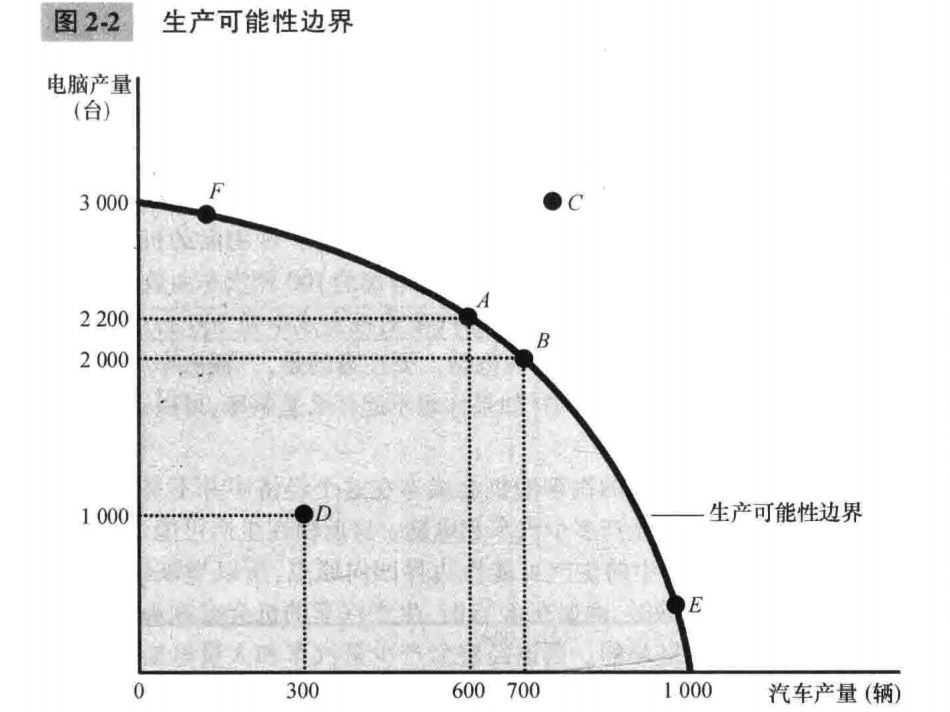

# 第2章 像经济学家一样思考

## 2.1 作为科学家的经济学家

经济学家努力以科学家的客观性去探讨他们的主题，方法大致相同：先提出理论，再收集数据，然后分析数据，以努力证明或批驳他们的理论。

科学的本质是**科学方法**——冷静地建立并检验有关世界如何运行的各种理论。

- 2.1.1 科学方法：观察、理论和进一步观察

  在经济学研究中，进行实验往往是不可能的。经济学家通常只能使用这个世界向他们提供的数据。

- 2.1.2 假设的作用

  假设可以使复杂的世界简单化，从而使解释这个世界变得更为容易。

- 2.1.3 经济模型

### 2.1.4 我们的第一个模型：循环流量图

**循环流量图（circular-flow diagram）**：一个说明货币如何通过市场在家庭与企业之间流动的直观经济模型。

在此之中，经济被简化为只由两类决策者——企业和家庭——组成。企业用劳动、土地、和资本（建筑物和机器）等投入品来生产物品与服务。这些投入品被称为**生产要素**。家庭则拥有生产要素并消费企业生产的所有物品与服务。

两类市场：

- 在物品与服务市场上，家庭购买企业生产的物品与服务
- 在生产要素市场上，家庭向企业提供用于生产物品与服务的投入，家庭是卖者，企业是买者。

两个环形：

- 内部环形：投入与产出的流向
- 外部环形：相应的货币流动

### 2.1.5 我们的第二个模型：生产可能性边界

**生产可能性边界（production possibilities frontier）**：表示在可得到的生产要素与生产技术既定时，一个经济所能生产的产品数量的各种组合的图形。

在上述例子中，则是汽车与电脑的数量组合。

- 如果一个经济从它可以获得的稀缺资源中获得了它能得到的全部东西，就称这种结果是有效率的。
- D点代表了一种无效率的结果。

用电脑数量来衡量的汽车的机会成本在这个经济中并不是不变的，而是取决于该经济要生产多少汽车和电脑，这也反映在生产可能性边界的形状上——斜率。

经济学家认为，生产可能性边界通常是这种凹向原点的形状（如图2-2）。

- 当经济把大部分资源用于生产电脑，如F点时，最适于汽车生产的资源，如熟练的汽车工人，都会被用于电脑行业。由于这些工人可能并不擅长生产电脑，多生产一辆汽车只会引起很小的电脑产量的减小。

  在F点，用电脑衡量的汽车的机会成本是较小的，而且生产可能性边界较为平坦。

- 而在E点，最适合生产汽车的资源已经用于汽车行业，多生产一辆汽车就意味着把一些最好的电脑技工从电脑行业中转移出来，让他们称为汽车工人。结果导致多生产一辆汽车就意味着汽车产量有相当大的减少。

  此时生产汽车的机会成本很搞，而且生产可能性边界是陡峭的。

但随着时间的推移，这些权衡取舍可能改变。比如电脑行业的技术进步使得行业在生产任何一个既定的汽车量时，都可以生产比以前更多的电脑。生产可能性曲线一端不变，另一端向上移动。

生产可能性边界简化了复杂的经济，以便强调一些基本但极为重要的概念：稀缺性、效率、权衡取舍、机会成本和经济增长。

### 2.1.6 微观经济学与宏观经济学

**微观经济学（microeconomics）**研究家庭和企业如何做出决策，以及它们如何在市场上相互交易的学科。

**宏观经济学（macroeconomics）**研究整体经济现象，包括通货膨胀、失业和经济增长的学科。

由于整体经济的变动产生于千百万个人的政策，所以不考虑相关的微观经济决策而要去理解宏观经济的发展是不可能的。

## 2.2 作为政策顾问的经济学家

