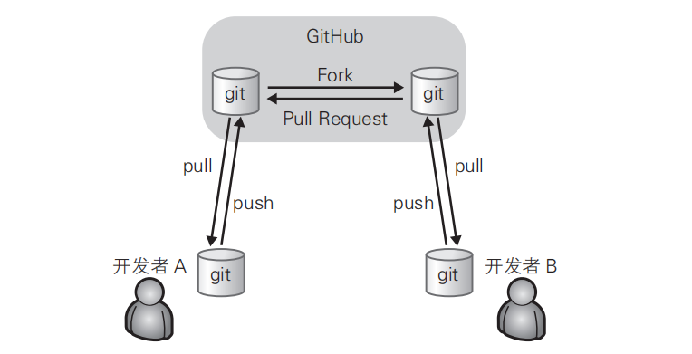

# 第2章 Git（导学）

## 2.1 诞生背景

Git 属于分散型版本管理系统，是为版本管理而设计的软件。

> Linux 的创始人 Linus Torvalds 在 2005 年开发了 Git 的原型程序。当时，由于在 Linux 内核开发中使用的既有版本管理系统的开发方许可证发生了变更，为了更换新的版本管理系统，Torvalds 开发了 Git。

## 2.2 什么是版本管理

版本管理就是管理更新的历史记录。它为我们提供了一些在软件开发过程中必不可少的功能，例如记录一款软件添加或更改源代码的过程，回滚到特定阶段，恢复误删除的文件等。

### 集中型与分散型

**集中型**将所有数据集中存放在服务器当中，有便于管理的优点。但是一旦开发者所处的环境不能连接服务器，就无法获取最新的源代码，开发也就几乎无法进行。服务器宕机时也是同样的道理，而且万一服务器故障导致数据消失，恐怕开发者就再也见不到最新的源代码了。


**分散型**拥有多个仓库，相对而言稍显复杂。不过，由于本地的开发环境中就有仓库，所以开发者不必连接远程仓库就可以进行开发。

图中只显示了一般的使用流程。实际上，所有仓库之间都可以进行push 和 pull。即便不通过 GitHub，开发者 A 也可以直接向开发者 B 的仓库进行 push 或 pull。因此在使用前如果不事先制定规范，初学者往往会搞不清最新的源代码保存在哪里，导致开发失去控制。



## 2.3 使用

> 需要安装git

打开Git Bash，从名字中带有 Bash 就不难猜到，Git Bash 中照搬了许多 Bash 命令，习惯 Linux 的人用起来会感觉比 Windows 命令提示符更得心应手。

首先来设置使用 Git 时的姓名和邮箱地址。名字请用英文输入。

```bash
$ git config --global user.name "Firstname Lastname"
$ git config --global user.email "your_email@example.com"
```

这个命令，会在“~/.gitconfig”中以如下形式输出设置文件。

```bash
[user]
 name = Firstname Lastname
 email = your_email@example.com
```

**配置文件的存储路径**

1. 仓库级的配置文件：在仓库的 .git/.gitconfig，该配置文件只对所在的仓库有效。 
2. 全局配置文件：Mac 系统在 ~/.gitconfig，Windows 系统在 C:Users<用户名>.gitconfig。 
3. 系统级的配置文件：在 Git 的安装目录下（Mac 系统下安装目录在 /usr/local/git）的 etc 文件夹中的.gitconfig。

**提高命令输出的可读性**

```bash
$ git config --global color.ui auto
```

```
[color]
 ui = auto
```

这样一来，各种命令的输出就会变得更容易分辨，提高可读性。

