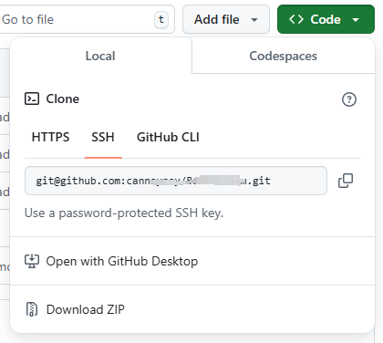

# 第3章 使用GitHub的前期准备

## 准备

- 创建账户

- 设置头像

- 设置 SSH Key

  GitHub 上连接已有仓库时的认证，是通过使用了 SSH 的公开密钥认证方式进行的。现在让我们来创建公开密钥认证所需的 SSH Key，并将其添加至 GitHub。

```bash
$ ssh-keygen -t rsa -C "your_email@example.com"
Generating public/private rsa key pair.
Enter file in which to save the key
(/Users/your_user_directory/.ssh/id_rsa): 按回车键
Enter passphrase (empty for no passphrase): 输入密码
Enter same passphrase again: 再次输入密码
Your identification has been saved in /Users/your_user_directory/.ssh/id_rsa.
Your public key has been saved in /Users/your_user_directory/.ssh/id_rsa.pub.
The key fingerprint is:
 fingerprint值 your_email@example.com
The key's randomart image is:
+--[ RSA 2048]----+
| .+ + |
| = o O . |
……
```

  id_rsa 文件是私有密钥，id_rsa.pub 是公开密钥。

- 添加公开密钥

  在 GitHub 中添加公开密钥，今后就可以用私有密钥进行认证了。

  点击右上角的账户设定按钮（Account Settings），选择 SSH Keys 菜单。

  添加成功之后，创建账户时所用的邮箱会接到一封提示“公共密钥添加完成”的邮件。

- 使用社区功能

### 实践

### New repository——创建仓库

- Repository name——仓库名称

- Description——仓库说明

- Public、Private——创建公开仓库，仓库内的所有内容都会被公开

- Initialize this repository with a README——随后GitHub 会自动初始化仓库并设置 README 文件，让用户可以立刻clone 这个仓库。如果想向 GitHub 添加手中已有的 Git 仓库，建议不要勾选，直接手动 push。

- Add .gitignore

  下方左侧的下拉菜单非常方便，通过它可以在初始化时自动生成 .gitignore 文件。这个设定会帮我们把不需要在 Git 仓库中进行版本管理的文件记录在 .gitignore 文件中，省去了每次根据框架进行设置的麻烦。下拉菜单中包含了主要的语言及框架，选择今后将要使用的即可。

- Add a license——选择要添加的许可协议文件

  如果这个仓库中包含的代码已经确定了许可协议，那么请在这里进行选择。随后将自动生成包含许可协议内容的 LICENSE 文件，用来表明该仓库内容的许可协议。

### 连接仓库

- README.md

  README.md 文件的内容会自动显示在仓库的首页当中。因此，人们一般会在这个文件中标明本仓库所包含的软件的概要、使用流程、许可协议等信息。使用Markdown 语法进行描述，添加标记，提高可读性。

- GitHub Flavored Markdown（GFM）

  在 GitHub 上进行交流时用到的 Issue、评论、Wiki，都可以用Markdown 语法表述，从而进行标记。

### 公开代码

- clone 已有仓库

  将尝试在已有仓库中添加代码并加以公开。首先将已有仓库 clone 到身边的开发环境中。

  

```bash
$ git clone git@github.com:hirocastest/Hello-World.git
Cloning into 'Hello-World'...
remote: Counting objects: 3, done.
remote: Total 3 (delta 0), reused 0 (delta 0)
Receiving objects: 100% (3/3), done.
$ cd Hello-World
```


  这里会要求输入 GitHub 上设置的公开密钥的密码。认证成功后，仓库便会被 clone 至仓库名后的目录中。将想要公开的代码提交至这个仓库再 push 到 GitHub 的仓库中，代码便会被公开。

- 提交

```bash
$ git add hello_world.php
$ git commit -m "Add hello world script by php"
[master d23b909] Add hello world script by php
1 file changed, 3 insertions(+)
create mode 100644 hello_world.php
```

  通过 git add命令将文件加入暂存区，再通过 git commit命令提交。

  添加成功后，可以通过 git log命令查看提交日志。

```bash
$ git log
commit d23b909caad5d49a281480e6683ce3855087a5da
Author: hirocastest <hohtsuka@gmail.com>
Date: Tue May 1 14:36:58 2012 +0900
 Add hello world script by php
```

- 进行 push

```bash
$ git push
Counting objects: 4, done.
Delta compression using up to 4 threads.
Compressing objects: 100% (2/2), done.
Writing objects: 100% (3/3), 328 bytes, done.
Total 3 (delta 0), reused 0 (delta 0)
To git@github.com:hirocastest/Hello-World.git
 46ff713..d23b909 master -> master
```

  这样一来代码就在 GitHub 上公开了。